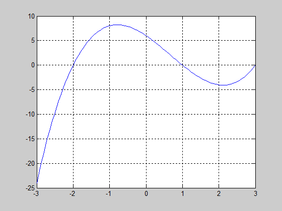
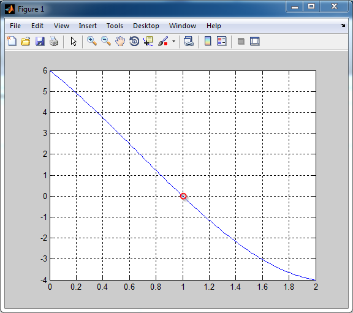

# 1. Основные определения

## Модель

**Модель** — представление объекта, системы или понятия (идеи) в некоторой форме, отличной от формы их реального существования.

Модель — упрощенное представление, отражающее наиболее характерные (интересующие) свойства объекта исследований.

## Модель служит для...

1. Прогнозирования поведения объекта.
2. Объяснения его устройства/поведения.
3. Обучения работе с объектом.
4. Передачи информации об объекте.

## Виды моделей

Модель может:

1. являться копией объекта исследований, выполненной из другого материала и в другом масштабе (**макет**, **физическая модель**);
2. отображать некоторые характерные свойства объекта в абстрактной форме (**математическая модель**).

## Макетирование

\scriptsize

)](images/car_clay_modeling.jpg)

## От математической модели к компьютерной программе

При использовании математического моделирования поведение системы описывается на языке математики, то есть с помощью уравнений (дифференциальных, алгебраических) и методов их решения (как правило, численных).

Математические уравнения вместе с методами их решения формулируются в виде **алгоритма** — последовательности операций, позволяющей решить задачу за конечное число этапов вычислений.

Алгоритм преобразуется в компьютерную программу, реализованную на том или ином языке программирования. 

## Имитационная модель = компьютерная модель

**Имитационная модель** — компьютерная программа, которая описывает структуру и/или воспроизводит поведение реальной системы во времени.

Мы рассматриваем только компьютерные модели. Поэтому термины "имитационное моделирование" и "компьютерное моделирование" будем считать синонимами и говорить просто о "моделях".

## Что мы понимаем под "моделированием"

Моделирование — это процесс, включающий создание модели и ее применение для изучения некоторой проблемы или явления.

## Резюме

* Модель — это упрощенное представление объекта исследований.
* Модели позволяют объяснять и прогнозировать поведение объекта исследований.
* Математическая модель отображает в абстрактной форме некоторые характерные свойства объекта.
* Компьютерная модель — математическая модель, реализованная в форме компьютерной программы.


# 2. Место моделирования в процессе принятия решений

## Процесс принятия решений:

1. Постановка цели.
2. Поиск информации.
3. Определение вариантов решений.
4. Оценка вариантов и выбор наилучшего решения.

## Постановка цели

Цель — желаемый результат, которого мы хотим достичь. 

Насколько грамотно мы сформулировали цель? Проверяем, пользуясь принципом SMART. Цель должна быть:

1. **S**pecific — конкретной. Необходимо четко сформулировать, что должно быть достигнуто. (*Выучить английский язык*)
2. **M**easurable — измеримой. Ваш планируемый результат, должен быть измерим в каких-то цифрах, быть «реально осязаемым». (*Сдать экзамен TOEFL*)
3. **A**ction-oriented — опирающейся на действия самого человека, а не на независящие от него факторы или других людей. (*Для этого мне необходимо пойти на курсы*)
4. **R**ealistic — реалистичной. Вы должны учесть имеющиеся у вас ресурсы. (*Кроме курсов, занятия потребуют не меньше получаса времени в день, а надо еще и работать*)
5. **T**ime-limited — ограниченной во времени. Важно определить конечный срок выполнения работы. (*К маю будущего года*)

## Место моделирования

1. Постановка цели.
2. Поиск информации.
3. \Large Определение вариантов решений. *Какое из решений на интересует? При каких параметрах системы оно достигается? Какие сценарии поведения системы нас интересуют?*
4. Оценка и выбор наилучшего из решений. *Что такое "наилучший"? Какой критерий для оценки качества решения использовать? Решений может быть много.*

## Резюме

* При создании модели необходимо представлять себе ее место в ходе решения конкретной задачи. Иногда это позволяет значительно упростить модель.
* Модели позволяют выработать варианты решения проблемы и выбрать наилучший из них.


# 3. Что дает компьютер?

## Компьютер позволяет выполнять расчеты

* быстрее;
* дешевле;
* иным способом, чем это было в "докомпьютерную эпоху".

## Поиск корней уравнения

Найдем корень уравнения
$$
x^3-2x^2-5x+6=0,
$$
расположенный на промежутке $[0;2]$ с точностью до 0.01.

## Строим график



<!--Чему равны корни уравнения?-->

## Ограничиваем область поиска корня



## Сужаем окрестность корня пока не достигнем нужной точности


## Задача. Найти корень уравнения

$$
x^3-x^2-5x+6=0,
$$

расположенный на промежутке $[1;1.5]$ с точностью до 0.01.

<!-- 1.305 -->


# 4. Особенности компьютерной арифметики

## Сложение

Попробуем вычесть на компьютере числа $10^{16}+1$ и $10^{16}$:

```
10^16 + 1 - 10^16 = 0
10^16 - 10^16 + 1 = 1
```

Т.е. сложение/вычитание чисел на компьютере **может оказаться некоммутативным**.

Поскольку это происходит с арифметическими действиями, то и результат вычисления функции на компьютере отличается от принятого в математике:

$\cos\pi/2=0$, a `cos(pi/2) = 6.1232е-17`.

## Предел

Второй замечательный предел:
$$
\lim_{{x\to \infty }}\left(1+{\frac {1}{x}}\right)^{x}=e \approx 2.718...
$$

Пробуем:

```
n = [1 1e3 1e7 1.2e11 1.2e13 1.7e14 1e15 3e15 5e15 8e15
     1e16 1e19];
(1+1./n).^n
```

Получаем:

```
[2.0000, 2.7169, 2.7183, 2.7183, 2.7161, 2.6683, 3.0350, 
 3.7896, 3.0350, 5.9083, 1.0000, 1.0000]
```

**Источник проблем лежит в несовпадении машинной арифметики с обычной из-за конечности разрядной сетки ЭВМ.**

## ПРК "Пэтриот", 25.02.1991 — ошибка при перехвате иракских ракет

\small

Время измерялось системными часами в десятках секунд, а затем умножалось на 1/10 чтобы получить результат в секундах. Вычисление производились с 24-разрядными числами. 

1/10 — бесконечная двоичная дробь, которая обрезалась после 24-го разряда. Появлялась ошибка округления, из-за которой батарея противоракет, находившаяся на боевом дежурстве около 100 часов, накапливала погрешность в определении времени в 0.34 с.

Ракета "Scud" (Р-17) летит со скоростью около 1676 м/с и за 0.34 с. пролетает около 0.5 километра. В итоге система ПРО не реагировала на подлетающую ракету, считая что та находится за пределами охраняемого участка.

\scriptsize

**Источник:** http://www-users.math.umn.edu/~arnold/disasters/patriot.html

## Проверим?

Что будет, если сравнить

```
0.3 == 0.3
```

А это?

```
0.4 - 0.1 == 0.3
```

## Что подлетало: Р-17


## Куда прилетело


## Ариан-5, 4.06.1996 — взрыв после 40 секунд полета

The rocket was on its first voyage, after a decade of development costing \$7 billion. The destroyed rocket and its cargo were valued at \$500 million. The cause of the failure was a software error in the inertial reference system. Specifically a 64 bit floating point number relating to the horizontal velocity of the rocket with respect to the platform was converted to a 16 bit signed integer. The number was larger than 32768, the largest integer storeable in a 16 bit signed integer, and thus the conversion failed.

\scriptsize

**Источник:** http://www-users.math.umn.edu/~arnold/disasters/ariane.html

## Резюме

* Основы точности расчетов закладываются на этапе выбора математической модели. Исходя из этого, выбираются численные методы и программные средства.
* Во время вычислений нашей целью является не испортить точность, заложенную в модели и исходных данных.
* Цель вычислений состоит в том, чтобы получить результат с заданной точностью. 

## Ссылки

* Шеннон Р. Имитационное моделирование систем — искусство и наука, М.: Мир, 1978.

### Вспоминаем математику

* Бёрд Дж. Инженерная математика: Карманный справочник. М.: Издательский дом «Додэка-ХХI», 2008. 544 с.

### Где искать

* Папка `/Литература`
* [Library Genesis: gen.lib.rus.ec](http://gen.lib.rus.ec)


## Контактная информация

\centering

**Преподаватель**: Храмов Дмитрий Александрович

**e-mail**: `dkhramov@mail.ru`

**веб-сайт**: [dkhramov.dp.ua](http://dkhramov.dp.ua/)

**skype **: `d_khramov`
