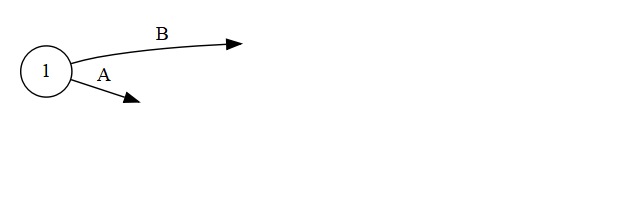
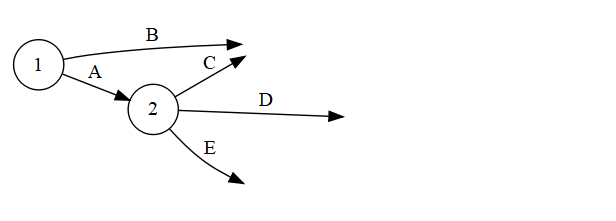

## Графы

\begin{center}
\includegraphics[width=140pt]{images/graphs.png}
\end{center}

\small

Множество точек — **вершин** A,B,C,D, — соединенных линиями — **ребрами** (A,B), (B,C), (B,D) — называют **графом**.

Последовательность вершин, соединенных ребрами — {A,B,C}, {a,b,c,d,e,a} — называют **путем**. Замкнутый путь, начинающий и заканчивающийся в одной вершине, называется **циклом**.

Граф, у которого две любые вершины соединены некоторым путем является **связным**.

## Ориентированный граф

\begin{center}
\includegraphics[width=200pt]{images/orgraph.png}
\end{center}

## Сетевые графики

Cетевые графики — ориентированные графы без циклов. Вершины именуют **событиями**, ребра (дуги) — **операциями**, или **работами**. 

\begin{center}
\includegraphics[width=165pt]{images/Pert_chart.png}
\end{center}

Сетевые графики описывают любые проекты:

* строительство дома
* запуск ракеты на Луну
* научный поиск
* и т. п. 

## История

В 1958 году в США разработан метод PERT (Program evaluation and review technique) и применен в проекте создания ракетной системы «Поларис».

Затем сетевые графики вошли в моду по всему миру.

В СССР использовали PERT с начала 1960-х гг., при проектировании Бурштынской ТЭС.

## Пример

\small

Городская администрация рассматривает возможность переустройства рынка. После сноса старых палаток проектом предусматривается строительство павильонов и сдача их в аренду торговым фирмам.

План работ:

\tiny

Работа | Содержание работы | Предшествующая работа  | Время
-------|-------------------|------------------------|--------------
A      | Подготовить архитектурный проект               | - | 5
B      | Определить будущих арендаторов                 | - | 6
C      | Подготовить проспект для арендаторов           | A | 4 
D      | Выбрать подрядчика                             | A | 3
E      | Подготовить документы для получения разрешения | A | 1
F      | Получить разрешение на строительство           | E | 4
G      | Осуществить строительство                      | D, F | 14
H      | Заключить контракты с арендаторами             | B, C | 12 
I      | Вселить арендаторов в павильоны                | G, H | 2

\small

Время выполнения работ указано в неделях.

## Строим сетевой график проекта - 1

\tiny

Работа | Содержание работы | Предшествующая работа  | Время
-------|-------------------|------------------------|--------------
A      | Подготовить архитектурный проект               | - | 5
B      | Определить будущих арендаторов                 | - | 6
C      | Подготовить проспект для арендаторов           | A | 4 
D      | Выбрать подрядчика                             | A | 3
E      | Подготовить документы для получения разрешения | A | 1
F      | Получить разрешение на строительство           | E | 4
G      | Осуществить строительство                      | D, F | 14
H      | Заключить контракты с арендаторами             | B, C | 12 
I      | Вселить арендаторов в павильоны                | G, H | 2

## Строим сетевой график проекта - 2

\tiny

Работа | Содержание работы | Предшествующая работа  | Время
-------|-------------------|------------------------|--------------
A      | Подготовить архитектурный проект               | - | 5
B      | Определить будущих арендаторов                 | - | 6
C      | Подготовить проспект для арендаторов           | A | 4 
D      | Выбрать подрядчика                             | A | 3
E      | Подготовить документы для получения разрешения | A | 1
F      | Получить разрешение на строительство           | E | 4
G      | Осуществить строительство                      | D, F | 14
H      | Заключить контракты с арендаторами             | B, C | 12 
I      | Вселить арендаторов в павильоны                | G, H | 2

## Строим сетевой график проекта - 3

\tiny

Работа | Содержание работы | Предшествующая работа  | Время
-------|-------------------|------------------------|--------------
A      | Подготовить архитектурный проект               | - | 5
B      | Определить будущих арендаторов                 | - | 6
C      | Подготовить проспект для арендаторов           | A | 4 
D      | Выбрать подрядчика                             | A | 3
E      | Подготовить документы для получения разрешения | A | 1
F      | Получить разрешение на строительство           | E | 4
G      | Осуществить строительство                      | D, F | 14
H      | Заключить контракты с арендаторами             | B, C | 12 
I      | Вселить арендаторов в павильоны                | G, H | 2

## Нумеруем вершины

\tiny

Работа | Содержание работы | Предшествующая работа  | Время
-------|-------------------|------------------------|--------------
A      | Подготовить архитектурный проект               | - | 5
B      | Определить будущих арендаторов                 | - | 6
C      | Подготовить проспект для арендаторов           | A | 4 
D      | Выбрать подрядчика                             | A | 3
E      | Подготовить документы для получения разрешения | A | 1
F      | Получить разрешение на строительство           | E | 4
G      | Осуществить строительство                      | D, F | 14
H      | Заключить контракты с арендаторами             | B, C | 12 
I      | Вселить арендаторов в павильоны                | G, H | 2

## Добавляем время работ

\tiny

Работа | Содержание работы | Предшествующая работа  | Время
-------|-------------------|------------------------|--------------
A      | Подготовить архитектурный проект               | - | 5
B      | Определить будущих арендаторов                 | - | 6
C      | Подготовить проспект для арендаторов           | A | 4 
D      | Выбрать подрядчика                             | A | 3
E      | Подготовить документы для получения разрешения | A | 1
F      | Получить разрешение на строительство           | E | 4
G      | Осуществить строительство                      | D, F | 14
H      | Заключить контракты с арендаторами             | B, C | 12 
I      | Вселить арендаторов в павильоны                | G, H | 2

Через сколько недель проект будет завершен?

## Вычисляем ранние сроки выполнения работ

\tiny

Работа | Содержание работы | Предшествующая работа  | Время
-------|-------------------|------------------------|--------------
A      | Подготовить архитектурный проект               | - | 5
B      | Определить будущих арендаторов                 | - | 6
C      | Подготовить проспект для арендаторов           | A | 4 
D      | Выбрать подрядчика                             | A | 3
E      | Подготовить документы для получения разрешения | A | 1
F      | Получить разрешение на строительство           | E | 4
G      | Осуществить строительство                      | D, F | 14
H      | Заключить контракты с арендаторами             | B, C | 12 
I      | Вселить арендаторов в павильоны                | G, H | 2

\begin{center}
\includegraphics[width=300pt]{images/net06.png}
\end{center}

Какие операции являются для проекта **критическими**? (т.е. сроки выполнения которых нельзя переносить без того, чтобы не задержать выполнение всего проекта).

## Определяем критические операции

\begin{center}
\includegraphics[width=300pt]{images/net07.png}
\end{center}

На сколько недель можно задержать выполнение работы H?

## Диаграмма Гантта

## Сетевой график и диаграмма Гантта позволяют

* четко представить структуру комплекса работ, выявить с любой степенью детализации их этапы и взаимосвязь;
* составить обоснованный план выполнения работ и проверить его;
* проводить анализ разных решений с целью улучшения плана;
* использовать компьютеры для обработки больших массивов информации компьютеры.

## Задача

Определить:

* длительность выполнения проекта;
* критические для проекта работы.

## Литература

1. Таха Х. Введение в исследование операций.  М.: Вильямс, 2005.  912 с.
2. Эддоус М., Стэнсфилд Р. Методы принятия решений.  М.: Аудит, ЮНИТИ, 1997.  590 с.
